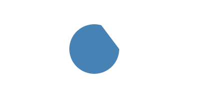

# react-canvas-next

A lightweight React-based Canvas drawing library. This library provides some basic shape components, such as `Path` and `BezierCurve`. And, some components have Svg-like properties. For example, the `d` property of the `Path` component is the same as the `d` property of the Svg path, and the `viewBox` property of the `Canvas` component is similar to the viewBox property of Svg.

## Basic usage

```tsx
<Canvas height={400} width={600} >
  <Rect
    fill="red"
    height={80}
    width={120}
    x={20}
    y={20}
  />
  <Rect
    fill="steelblue"
    height={80}
    width={120}
    x={160}
    y={20}
  />
  <Group
    fill="darkgoldenrod"
    lineWidth={4}
    stroke="deeppink"
  >
    <Rect
      height={25}
      width={25}
    />
    <Rect
      height={25}
      width={25}
      x={30}
    />
    <Rect
      fill="yellow"
      height={25}
      width={25}
      x={10}
      y={10}
    />
  </Group>
  <Circle
    cX={360}
    cY={60}
    fill="green"
    lineWidth={0}
    r={40}
  />
  <Text
    fill="yellow"
    font="80px seril"
    text="Nice Work"
    textBaseline="top"
    x={200}
    y={200}
  />
</Canvas>
```


## Components

### Canvas

Canvas with viewBox

```tsx
<Canvas width={400} height={400} viewBox={[0, 0, 800, 800]} style={{ border: '1px solid red' }}>
  <Rect x={200} y={200} width={400} height={400} fill='steelblue' />
  <Circle cX={400} cY={400} r={150} fill='white' />
</Canvas>
```


### Line

```tsx
<Line
  stroke='steelblue'
  lineWidth={5}
  start={[30, 50]}
  end={[150, 100]}
  // `start` and `end` also can use follow props
  // x={30}
  // y={50}
  // endX={150}
  // endY={100}
/>
```

### Polygon

```tsx
<Polygon
  fill='steelblue'
  points={[
    100, 100, // x1, y1
    150, 25,  // x2, y2
    150, 75,  // x3, y3
    200, 0,   // x4, y4
    // ...
  ]}
/>
```


### Rect

```tsx
<Rect
  start={[10, 20]}  // x={10} y={20}
  size={[150, 100]} // width={150} height={100}
  fill='steelblue'
/>
```


### Arc

```tsx
<Arc
  center={[200, 100]} // cX={200} cY={100}
  r={50}
  startAngle={0} // in radians, measured from the positive x-axis
  endAngle={5}   // in radians, measured from the positive x-axis
  fill='steelblue'
/>
```



### Circle

```tsx
<Circle
  center={[200, 150]} // cX={200} cY={150}
  fill="steelblue"
  r={50} // radius
/>
```


### Ellipse

```tsx
<Ellipse
  center={[200, 150]} // cX={200} cY={150}
  radius={[150, 80]}  // rX={150} rY={80} // The ellipse's radius
  rotation={Math.PI / 4}
  startAngle={0}
  endAngle={1.6 * Math.PI}
  fill='palegoldenrod'
/>
```


### ArcCurve

```tsx
<ArcCurve
  start={[200, 20]}      // x={200} y={20}
  control1={[200, 130]}  // cp1X={200} cp1Y={130}
  control2={[50, 20]}    // cp2X={50} cp2Y={20}
  r={40}  // radius
  stroke='darkcyan'
/>
```


### BezierCurve

```tsx
<BezierCurve
  start={[50, 20]}      // starting point, same as x={50} y={20}
  control1={[230, 30]}  // first control point, same as cp1X={230} cp1Y={30}
  control2={[150, 80]}  // second control point, same as cp2X={150} cp2Y={80} 
  end={[250, 100]}      // endX={250} endY={100}
  fill='transparent'
  stroke='steelblue'
  lineWidth={2}
/>
```


### QuadraticCurve

```tsx
<QuadraticCurve
  start={[50, 20]}     // x={50} y={20}
  control={[230, 30]}  // cpX={230} cpY={30}
  end={[50, 100]}      // endX={50} endY={100}
  stroke='steelblue'
/>
```


### Path

Use attribute `d` to control, the same as svg

```tsx
<Path
  fill='red'
  stroke='steelblue' // stroke color
  lineWidth={2}      // stroke width
  d={`
    M 10,30
    A 20,20 0,0,1 50,30
    A 20,20 0,0,1 90,30
    Q 90,60 50,90
    Q 10,60 10,30 z
  `}
/>
```


### Image

```tsx
<Image
  src='/mk-logo.png'
  // area on image
  source={{
    x: 256,
    y: 256,
    height: 512,
    width: 512
  }}
  // drawn area
  dest={{
    x: 20,
    y: 20,
    width: 200
  }}
/>
```


### Text

```tsx
<Text
  text='Hello World'
  font='48px serif'
  fill='#4884b6'
  stroke='#c8ca42'
  textBaseLine='top'
  x={20}
  y={10}
/>
```


### Group

```tsx
<Group
  fill="darkgoldenrod" // Default `fill` for children
  lineWidth={4}        // Default `lineWidth` for children
  stroke="deeppink"    // Default `stroke` for children
  transform={[translate(160, 40), rotate(Math.PI / 180 * 30)]} // transforms
>
  <Rect
    height={25}
    width={25}
  />
  <Rect
    height={25}
    width={25}
    x={30}
  />
  <Rect
    fill="yellow"
    height={25}
    width={25}
    x={10}
    y={10}
  />
</Group>
```

## To-Do

- Event system
- Animation
